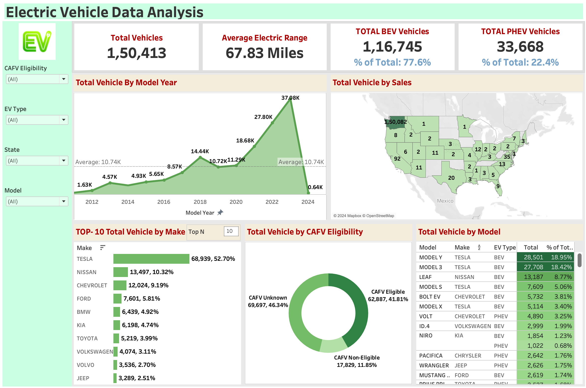
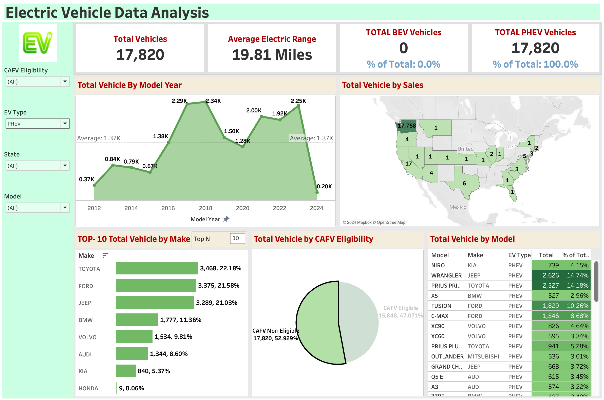

# Electric Vehicle Population Data Analysis Dashboard

An interactive Business Intelligence (BI) dashboard built using Tableau to analyze market trends, battery range efficiencies, and spatial distribution patterns across over 150,000 Electric Vehicles (EVs).

---

## 📊 Dashboard Previews

### Overview (All Vehicle Types)

### Segmented view (Plug-in Hybrid Electric Vehicles)

---

## 💡 Key Insights & Data Metrics
* **Market Dominance:** Tesla heavily dominates the local market data segment with over **52% total share** (68,939 vehicles), with the Model Y and Model 3 taking the top two spots respectively.
* **Vehicle Segmentation:** Battery Electric Vehicles (BEVs) lead consumer adoption over Plug-in Hybrids, making up **77.6% of total market composition** (1,16,745 units).
* **Battery Efficiency Constraints:** Plug-In Hybrids (PHEVs) exhibit highly restrictive environmental profiles, maintaining an average clean driving range of only **19.81 miles** compared to the general market's broader cross-segment capacities.
* **CAFV Compliance Tracking:** 41.81% of total vehicles tracked cleanly meet Clean Alternative Fuel Vehicle eligibility guidelines, while nearly half (46.34%) retain an unknown classification pending manufacturer range testing criteria.

---

## 🛠️ BI Tools & Technical Methods Used
* **BI Tooling:** Tableau Desktop
* **Parameters & N-Filtering:** Created custom dynamic "Top N" parameter controls allowing users to immediately segment vehicle makes down to specific high-density limits.
* **Calculated Fields:** Formulated specific cross-aggregation math models to compute exact percentages of total dynamically when global filter adjustments change views.
* **Geospatial Analytics:** Embedded interactive custom mapping using layered coordinate values to accurately render density colors for distinct geographical constraints.

---

## 📂 Project Directory Files
* `Dashboard.twb`: Packaged Tableau presentation architecture and visual layers.
* `Electric_Vehicle_Population_Data.csv`: Clean structured foundational dataset compiled tracking global registration fields.
